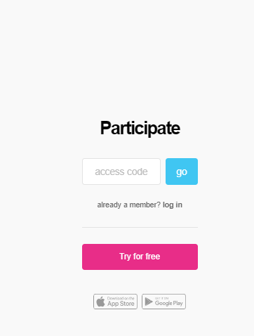
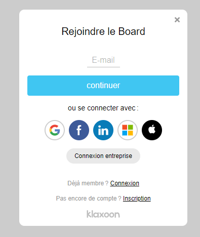
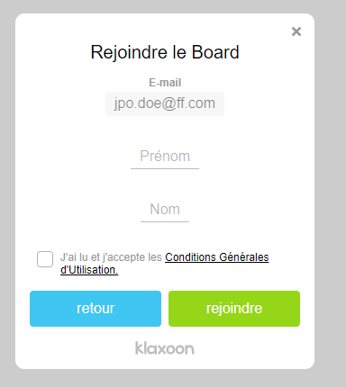
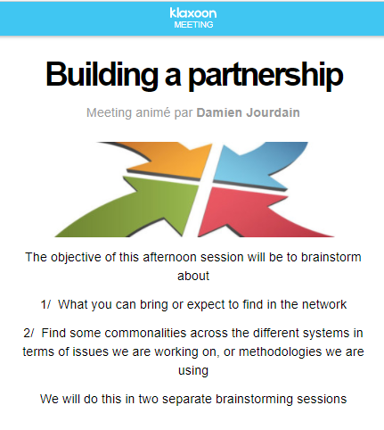

---
# An instance of the Blank widget.
# Documentation: https://sourcethemes.com/academic/docs/page-builder/
widget: blank

# Activate this widget? true/false
active: true

# This file represents a page section.
headless: true

# Order that this section appears on the page.
weight: 15

title: Logistics
subtitle:

design:
  columns: "1"
  background:
    image: headers/bubbles-wide.jpg
    image_darken: 0.6
    image_parallax: true
    image_position: center
    image_size: cover
    text_color_light: true
  spacing:
    padding: ["20px", "0", "20px", "0"]

---

## Meeting Links

The meeting will be organized on-line and we will use Zoom. 

*We will ask you to connect to the links that we will provide you 15 minutes ahead of the meeting time so that we can solve the usual connection issues.*

### Zoom

We assume that everyone is familiar with Zoom. We will send you the necessary links.

### Klaxoon
For the afternoon sessions, in addition to the Zoom session, we will also use a whiteboard application (Klaxoon). Klaxoon does not require any prior installation, and you will use it in your browser. 

To join us on `Klaxoon`, follow these instructions:

1 Open your browser and open the [Klaxoon website](https://klaxoon.com)

2 On the left of the screen, you will see an invitation to enter a code:

3 Enter the code that we will give to you by e-mail

4 If you never used Klaxoon on this browser, a new window will open asking for your email

5 Then to fill your name and surname

6 Once done, click on the Join Button

7 You should have joined the Klaxoon session and see the following screen:

## Language
The language used during the meeting and for presentations will be English. 

## Recording
If all participants agree, the discussions will be recorded and later made available to all participants. 
